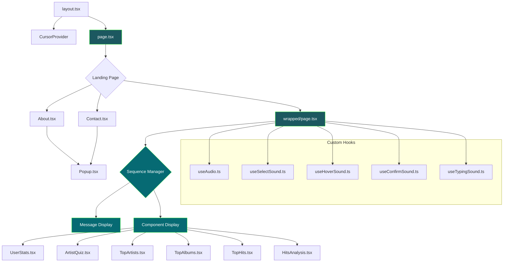
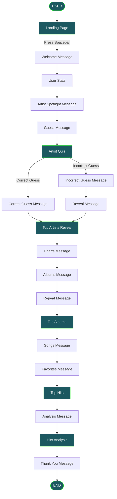

# Spotify Wrapped 2024 (90s Edition) 🎧


https://github.com/user-attachments/assets/a5863a43-c6c7-4d60-b074-d8e9510bb16b


> An interactive web application that reimagines Spotify Wrapped through the lens of 90s aesthetics and 8-bit graphics.

---

## 📋 Table of Contents

- [Overview](#-overview)
- [Tech Stack](#️-tech-stack)
- [Core Features](#-core-features)
- [Interactive UI Components](#️-interactive-ui-components)
- [Architecture](#️-architecture)
- [User Flow](#-user-flow)
- [Getting Started](#-getting-started)
  - [Prerequisites](#-prerequisites)
  - [Installation](#-installation)
  - [Project Structure](#-project-structure)
  - [Development Notes](#-development-notes)

---

## 📜 Overview 
What began as an experimental year-end recap in 2016, Spotify Wrapped quickly evolved into a global tradition, inviting users from all over the world to discover their musical narrative and collectively celebrate the sounds that defined the year.

This project serves as a creative reimagining of Spotify Wrapped and draws design inspiration from 90s aesthetics and 8-bit graphics. It also serves as a technical demonstration of how modern web development technologies can create immersive narrative-driven experiences while embracing nostalgic and retro elements. 

## 🛠️ Tech Stack 
- **Frontend Framework**: Next.js 15.1.0 with React 18.2.0
- **Styling**: TailwindCSS 3.4.1 with custom CSS animations and effects
- **Fonts**: Google Fonts (Pixelify Sans) for retro pixel text aesthetics
- **Data Visualization**: Recharts 2.15.0 for interactive charts and graphs
- **State Management**: React useState and useEffect hooks for component-level state
- **Routing**: Next.js App Router with client-side navigation
- **Animation**: Custom CSS transitions and keyframe animations
- **Responsive Design**: TailwindCSS responsive classes with custom viewport handling
- **Type Safety**: TypeScript for type checking and developer experience


## 🎵 Core Features

<table> <tr> <td align="center"> <h3>🎮 Interactive Artist Quiz</h3> <p>Guess your top artist from multiple choices with interactive feedback</p> </td> <td align="center"> <h3>📊 Musical Taste Analysis</h3> <p>Interactive pie chart visualization of your musical preferences</p> </td> </tr> <tr> <td align="center"> <h3>💿 Top Albums Reveal</h3> <p>Interactive reveal of top albums with animated transitions</p> </td> <td align="center"> <h3>⌨️ Typewriter Messages</h3> <p>Animated typewriter effect for messages with retro cursor</p> </td> </tr> </table>

## 🎛️ Interactive UI Components

<table> <tr> <th colspan="2" align="center">Key Components Overview</th> </tr> <tr valign="top"> <td width="50%">

### ArtistQuiz.tsx

Interactive quiz where users guess their top artist of the year

**Key Features:**

- Multiple choice artist selection
- Interactive buttons with hover effects
- Mystery icon that hides the answer
- Spacebar progression after selection

**Component Logic:**

```typescript
const [selectedArtist, setSelectedArtist] = useState<Artist | null>(null);

// When spacebar is pressed and artist selected
onComplete(selectedArtist === "TAYLOR SWIFT", selectedArtist);
```

</td> <td width="50%">

### HitsAnalysis.tsx

Visual breakdown of user's musical taste using an interactive pie chart

**Technologies:**

- Recharts for data visualization
- Interactive pie segments
- Percentage-based progress bars

**Chart Implementation:**

```typescript
const data = [
  { name: 'Pop', value: 45 },
  { name: 'Hip-Hop', value: 30 },
  { name: 'Rock', value: 15 },
  { name: 'Other', value: 10 }
];
```

</td> </tr> <tr valign="top"> <td width="50%">

### TopAlbums.tsx

Interactive component showing top 3 albums globally

```typescript
albums = [
  { id: 1, image: '/billie-album.png', revealed: false },
  { id: 2, image: '/taylor-album.png', revealed: false },
  { id: 3, image: '/sabrina-album.png', revealed: false }
]
```

**Features:**

- Click to reveal hidden albums
- Transition animations
- Auto-progress after all revealed

</td> <td width="50%">

### TopArtists.tsx

Reveals the top artist with animations and transitions to top 10 list

```typescript
// Animation sequence with timeouts
addTimeout(() => setIsShaking(true), 1000);
addTimeout(() => setIsMysteryFading(true), 2000);
addTimeout(() => setShowTaylorSwift(true), 3500);
```

**Animations:**

- Sequential animation timeline
- Crown visual indicator

</td> </tr> <tr valign="top"> <td width="50%">

### TopHits.tsx

Displays top 10 songs globally with responsive layout

```typescript
useEffect(() => {
  const handleKeyDown = (event) => {
    if (event.code === 'Space' && onComplete) {
      onComplete();
    }
  };
  window.addEventListener('keydown', handleKeyDown);
}, [onComplete]);
```

**Features:**

- Responsive image sizing
- Fade-in animation
- Spacebar navigation

</td> <td width="50%">


### UserStats.tsx

Displays Spotify user statistics with engaging visualizations

```typescript
return (
  <div className={`w-full h-full flex flex-col items-center justify-center ${isVisible ? 'fade-in' : 'opacity-0'}`}>
    <h2>SPOTIFY ACHIEVED</h2>
    <div>...</div>
  </div>
);
```

**Components:**

- User ranking visualization
- World map visualization

</td> </tr> </table>


## 🏗️ Architecture



### Component Architecture

The application is built around a central sequence controller in `wrapped/page.tsx` that manages the flow between different states:

- **Sequence State Manager**: Controls the progression through different components and message states
- **Message Display**: Handles typewriter effect text animations
- **Component Display**: Conditionally renders interactive components with fade transitions
- **Custom Hooks**: Provides sound effects, audio management, and animation control

## 🔄 User Flow



## 🚀 Getting Started

### 📋 Prerequisites

- Node.js 14.x or higher
- npm or yarn package manager
- Minimum viewport width of 700px for optimal experience

### 💾 Installation

- Clone the repository:
    
    ```bash
    git clone https://github.com/katjpg/90s-wrapped.git
    cd 90s-wrapped
    ```
    
- Install dependencies:
    
    ```bash
    npm install
    # or
    yarn install
    ```
    
- Run the development server:
    
    ```bash
    npm run dev
    # or
    yarn dev
    ```
    
- Open your browser and navigate to:
    
    ```
    http://localhost:3000
    ```
    

### 📁 Project Structure

- `/app` - Main application directory (Next.js App Router)
    - `/components` - Reusable UI components
    - `/hooks` - Custom React hooks
    - `/pages` - Page components including wrapped experience
    - `/public` - Static assets like images and sounds
    - `globals.css` - Global CSS styles including animations
    - `layout.tsx` - Root layout component with font loading

### 📝 Development Notes

- The application requires a minimum viewport width of 700px
- Custom cursor is enabled by default and can be styled in globals.css
- All typewriter animations timing can be adjusted in constants
- Component sequence is defined in the `SequenceState` type
- Additional content can be added by extending the sequence states
